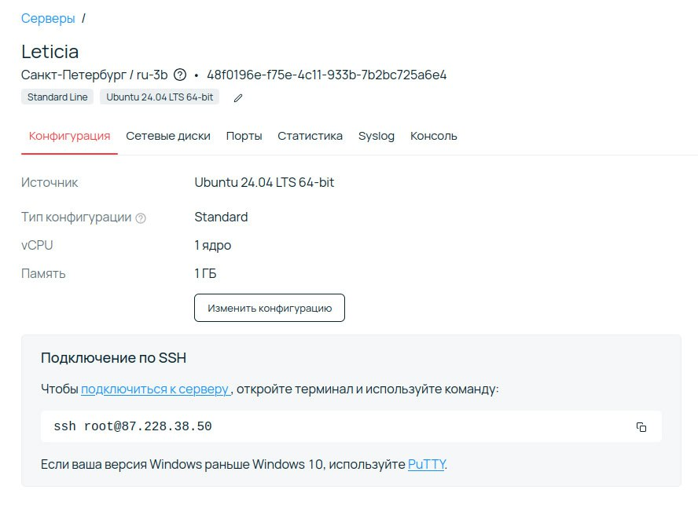
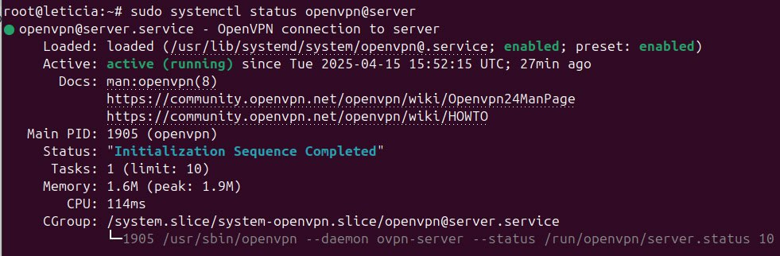
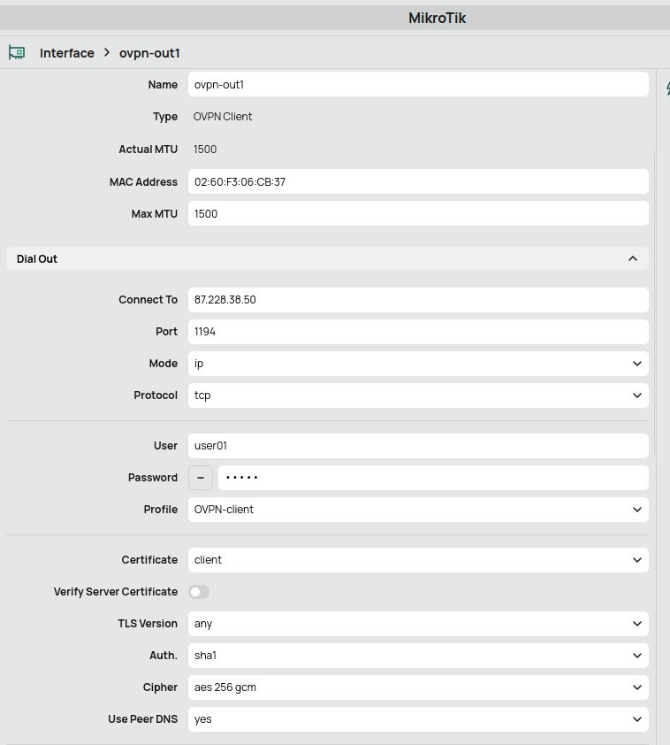
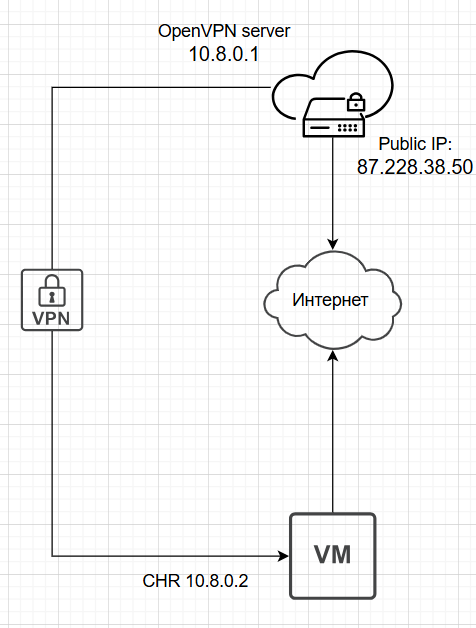
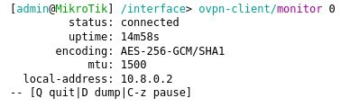
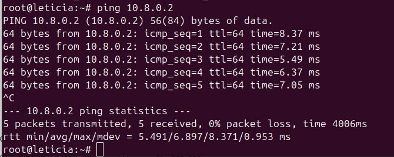
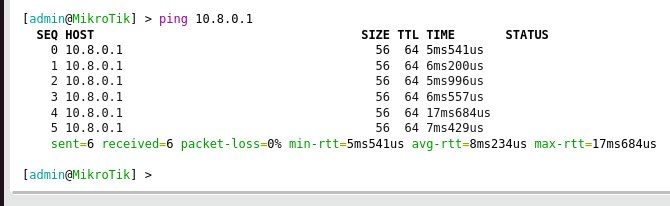

University: [ITMO University](https://itmo.ru/ru/)

Faculty: [FICT](https://fict.itmo.ru)

Course: [Network programming](https://github.com/itmo-ict-faculty/network-programming)

Year: 2024/2025

Group: K3320

Author: Bakhtina Anastasia Viacheslavovna

Lab: Lab1

Date of create: 15.04.2025

Date of finished: 16.04.2025

# Отчёт по лабораторной работе №1 "Установка CHR и Ansible, настройка VPN"

***Цель:*** Целью данной работы является развертывание виртуальной машины на базе платформы Microsoft Azure с установленной системой контроля конфигураций Ansible и установка CHR в VirtualBox.

## Ход работы

1) Для выполнения первой работы был приобретен сервер на базе платформы Selectel с конфигурацией: 1 CPU, 32 ГБ SSD-диск, публичный ip-адрес:


2) Затем на сервере была выполнена установка Ansible
3) Также был настроен OpenVPN сервер(```sudo apt install -y openvpn openvpn-systemd-resolved easy-rsa```) со следующей конфигурацией:

```
port 1194

proto tcp
proto tcp6

dev tun

ca /etc/openvpn/easy-rsa/pki/ca.crt
cert /etc/openvpn/easy-rsa/pki/issued/openvpn.networklab.com.crt
key /etc/openvpn/easy-rsa/pki/private/openvpn.networklab.com.key

dh /etc/openvpn/easy-rsa/pki/dh.pem

topology subnet

server 10.8.0.0 255.255.255.0
server-ipv6 2001:db8:0:123::/64

ifconfig-pool-persist /var/log/openvpn/ipp.txt

push "redirect-gateway def1 bypass-dhcp"
push "route-ipv6 2000::/3"

client-to-client

keepalive 10 120

persist-key
persist-tun

status /var/log/openvpn/openvpn-status.log

verb 3

explicit-exit-notify 1
```

4) Запускаем сервер:

   
5) Далее необходимо было настроить openvpn-client для MicroTik в VirtualBox на локальной машине(предварительно перенеся файлы(ca.crt, user01.crt, user01.key) с помощью scp с сервера на виртуалку и импортировать их через /certificate import):

   
   В результате была получена следующая схема взаимодействия устройств:


6) Подключение к OpenVPN в MicroTik:


7) Пинги внутри туннеля между клиентом и сервером:

SERVER --> CLIENT



CLIENT --> SERVER



###  Вывод

В результате выполнения первой лабораторной работы было осуществлено развертывание виртуальной машины на базе платформы Microsoft Azure с установленной системой контроля конфигураций Ansible и была выполнена установка CHR в VirtualBox
