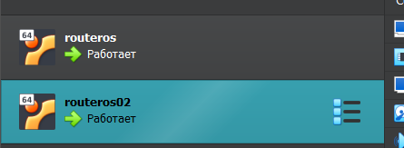
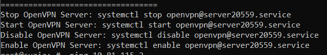
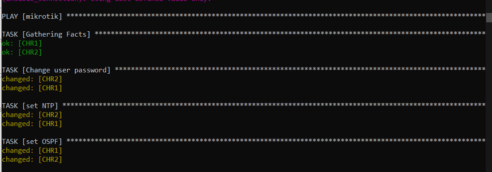
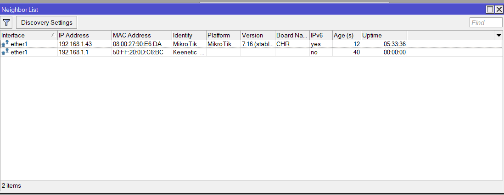
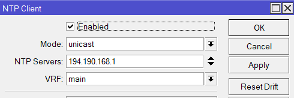
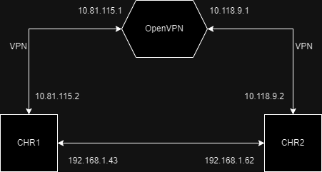

# LAB 2

University: [ITMO University](https://itmo.ru/ru/)  
Faculty: [FICT](https://fict.itmo.ru)  
Course: [Network programming](https://github.com/itmo-ict-faculty/network-programming)  
Year: 2024/2025  
Group: K3320  
Author: Bakhtina Anastasia Viacheslavovna  
Lab: Lab2  
Date of create: 12.05.2025  
Date of finished: 16.05.2025

## Цель

Развернуть второй CHR. Настроить конфигурацию посредством ansible.

## Выполнение

1. Был развернут второй CHR.



2. Был создан OVPN клиент для нового CHR аналогично первой лабораторной работе.



3. Был написан inventory, описывающий необходимые параметры для подключения и настройки ntp, ospf.

```yaml
all:
  vars:
    ntp: 194.190.168.1
  hosts:
    CHR1:
      ansible_host: 10.81.115.2
      ansible_user: admin
      ansible_password: admin
      ansible_connection: ssh
      ansible_ssh_common_args: '-o StrictHostKeyChecking=no'
      password: admin
      new_password: admin1
      ospf_router_id: 1.1.1.1
      ansible_remote_tmp: /tmp
      ansible_connection: network_cli
      ansible_network_os: routeros
    CHR2:
      ansible_host: 10.118.9.2
      ansible_user: admin
      ansible_password: admin
      ansible_connection: ssh
      ansible_ssh_common_args: '-o StrictHostKeyChecking=no'
      password: admin
      new_password: admin2
      ospf_router_id: 2.2.2.2
      ansible_remote_tmp: /tmp
      ansible_connection: network_cli
      ansible_network_os: routeros
```

4. Был написан ansible playbook для смены пароли, настройка ntp и ospf. Также для просмотра полной конфигурации, в которую входит конфигурация ospf.

```yaml
- name: mikrotik
  hosts: all
  tasks:
    - name: Change user password
      community.routeros.command:
      commands:
        - /user set admin password={{new_password}}

    - name: set NTP
      community.routeros.command:
      commands:
        - /system ntp server set enabled=yes primary-ntp={{ntp}}

    - name: set OSPF
      community.routeros.command:
      commands:
        - /routing ospf instance add name=default
        - /interface bridge add name=loopback
        - /ip address add address={{ospf_router_id}} interface=loopback
        - /routing ospf instance set 0 router-id={{ospf_router_id}}
        - /routing ospf area add instance=default name=backbone
        - /routing ospf interface-template add area=backbone interfaces=ether1 type=ptp

    - name: Get full configuration
      community.routeros.command:
      commands:
        - /export
      register: full_config

    - name: Print full configuration
      ansible.builtin.debug:
      var: full_config
```

5. Запустим playbook



_Полученные конфигурации_

```yaml
    "full_config": {
        "changed": true,
        "failed": false,
        "stdout": [
            "# 2024-10-18 17:24:39 by RouterOS 7.16\n# software id = \n#\n/interface bridge\nadd name=loopback\n/interface ovpn-client\nadd certificate=openvpn cipher=aes256-cbc connect-to=31.129.35.149 \\\n    mac-address=02:8A:61:A8:01:2C name=ovpn-out1 port=26198 user=\\\n    mikrotik26198\n/routing ospf instance\nadd disabled=no name=default router-id=1.1.1.1\n/routing ospf area\nadd disabled=no instance=default name=backbone\n/ip address\nadd address=1.1.1.1 interface=loopback network=1.1.1.1\n/ip dhcp-client\nadd interface=ether1\n/routing ospf interface-template\nadd area=backbone disabled=no interfaces=ether1 type=ptp\n/system note\nset show-at-login=no\n/system ntp client\nset enabled=yes\n/system ntp client servers\nadd address=194.190.168.1"
        ],
        "stdout_lines": [
            [
                "# 2024-10-18 17:24:39 by RouterOS 7.16",
                "# software id = ",
                "#",
                "/interface bridge",
                "add name=loopback",
                "/interface ovpn-client",
                "add certificate=openvpn cipher=aes256-cbc connect-to=31.129.35.149 \\",
                "    mac-address=02:8A:61:A8:01:2C name=ovpn-out1 port=26198 user=\\",
                "    mikrotik26198",
                "/routing ospf instance",
                "add disabled=no name=default router-id=1.1.1.1",
                "/routing ospf area",
                "add disabled=no instance=default name=backbone",
                "/ip address",
                "add address=1.1.1.1 interface=loopback network=1.1.1.1",
                "/ip dhcp-client",
                "add interface=ether1",
                "/routing ospf interface-template",
                "add area=backbone disabled=no interfaces=ether1 type=ptp",
                "/system note",
                "set show-at-login=no",
                "/system ntp client",
                "set enabled=yes",
                "/system ntp client servers",
                "add address=194.190.168.1"
            ]
        ]
    }
}
ok: [CHR2] => {
    "full_config": {
        "changed": true,
        "failed": false,
        "stdout": [
            "# 2024-10-18 17:24:46 by RouterOS 7.16.1\n# software id = \n#\n/interface bridge\nadd name=loopback\n/interface ovpn-client\nadd certificate=cert2 cipher=aes256-cbc connect-to=31.129.35.149 mac-address=\\\n    02:C2:39:0D:3F:02 name=ovpn-out1 port=20559 user=mikrotik20559\n/routing ospf instance\nadd disabled=no name=default router-id=2.2.2.2\n/routing ospf area\nadd disabled=no instance=default name=backbone\n/ip address\nadd address=2.2.2.2 interface=loopback network=2.2.2.2\n/ip dhcp-client\nadd interface=ether1\n/routing ospf interface-template\nadd area=backbone disabled=no interfaces=ether1 type=ptp\n/system note\nset show-at-login=no"
        ],
        "stdout_lines": [
            [
                "# 2024-10-18 17:24:46 by RouterOS 7.16.1",
                "# software id = ",
                "#",
                "/interface bridge",
                "add name=loopback",
                "/interface ovpn-client",
                "add certificate=cert2 cipher=aes256-cbc connect-to=31.129.35.149 mac-address=\\",
                "    02:C2:39:0D:3F:02 name=ovpn-out1 port=20559 user=mikrotik20559",
                "/routing ospf instance",
                "add disabled=no name=default router-id=2.2.2.2",
                "/routing ospf area",
                "add disabled=no instance=default name=backbone",
                "/ip address",
                "add address=2.2.2.2 interface=loopback network=2.2.2.2",
                "/ip dhcp-client",
                "add interface=ether1",
                "/routing ospf interface-template",
                "add area=backbone disabled=no interfaces=ether1 type=ptp",
                "/system note",
                "set show-at-login=no",
                "/system ntp client",
                "set enabled=yes",
                "/system ntp client servers",
                "add address=194.190.168.1"
            ]
        ]
    }
}

```

## Результаты

1. Проверим ospf. Появился "сосед".



2. Проверим ntp. Появилась конфигурация.



3. Пароли были сменены.

## Схема


