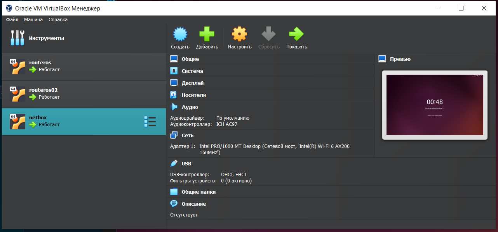
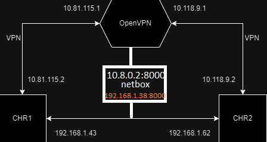

University: [ITMO University](https://itmo.ru/ru/)

Faculty: [FICT](https://fict.itmo.ru)

Course: [Network programming](https://github.com/itmo-ict-faculty/network-programming)

Year: 2024/2025

Group: K3320

Author: Bakhtina Anastasia Viacheslavovna

Lab: Lab3

Date of create: 29.05.2025

Date of finished: 29.05.2025

# Отчёт по лабораторной работе №3 "Развертывание Netbox, сеть связи как источник правды в системе технического учета Netbox"

***Цель:***  С помощью Ansible и Netbox собрать всю возможную информацию об устройствах и сохранить их в отдельном файле.

## Ход работы

1. Был развернут образ Ubuntu в Virtual Box



2. Был найден docker compose для netbox и соотвественно поднят netbox


3. В netbox была заполнена информация о двух маршритузаторах.


4. Был создан api key для ansible


5. Был написан playbook для извлечения всех девайсов. Результаты в файле devices.json.

```yaml
---
- name: Fetch Info from NetBox
  hosts: localhost
  gather_facts: false
  vars:
    netbox_url: "http://10.8.0.2:8000"
    netbox_token: "f2e653157a85af12d2cdc87ad9032b802affe31d"

  tasks:
    - name: Fetch info
      uri:
        url: "{{ netbox_url }}/api/dcim/devices"
        headers:
          Authorization: "Token {{ netbox_token }}"
        method: GET
        return_content: yes
        validate_certs: false
      register: device_data

    - name: Create file data
      copy:
        content: "{{ device_data.json | to_nice_json }}"
        dest: "devices.json"
```

6. В inventory был добавлен netbox id, чтобы была возможность синхронизировать данные
7. Был написан плейбук для добавления ip и name

```yaml
---
- name: Fetch Info from NetBox
  hosts: all
  gather_facts: false
  vars:
    netbox_url: "http://10.8.0.2:8000"
    netbox_token: "f2e653157a85af12d2cdc87ad9032b802affe31d"

  tasks:
    - name: Fetch Info
      uri:
        url: "{{ netbox_url }}/api/dcim/devices/{{ netbox_id }}"
        headers:
          Authorization: "Token {{ netbox_token }}"
        method: GET
        return_content: yes
        validate_certs: false
      register: data

    - name: Json to dict
      set_fact:
        device: "{{ data.content | from_json }}"

    - name: Change Name and IP
      community.routeros.command:
        commands:
          - /system identity set name={{ device.name }}
          - /ip address add address={{ device.primary_ip.address }} interface=netbox disabled=no
```

 8. Был написан плейбук для синхронизации серийного номера устройств

```yaml
---
- name: Fetch Info from NetBox
  hosts: all
  gather_facts: false
  vars:
    netbox_url: "http://10.8.0.2:8000"
    netbox_token: "f2e653157a85af12d2cdc87ad9032b802affe31d"

  tasks:
    - name: Get system
      community.routeros.command:
        commands:
          - /system license print
      register: serial_output

    - name: Get serial nuber
      set_fact:
        serial_number: "{{ serial_output.stdout_lines[0][0] | regex_search('system-id: (\\S+)','\\1') }}"

    - name: PATCH NETBOX Serial Number
      uri:
        url: "{{ netbox_url }}/api/dcim/devices/{{ netbox_id }}/"
        method: PATCH
        headers:
          Authorization: "Token {{ netbox_token }}"
          Content-Type: "application/json"
        body:
          serial: "{{ serial_number[0] | string }}"
        body_format: json
        validate_certs: no
      register: update_response
```


## Схема работы


