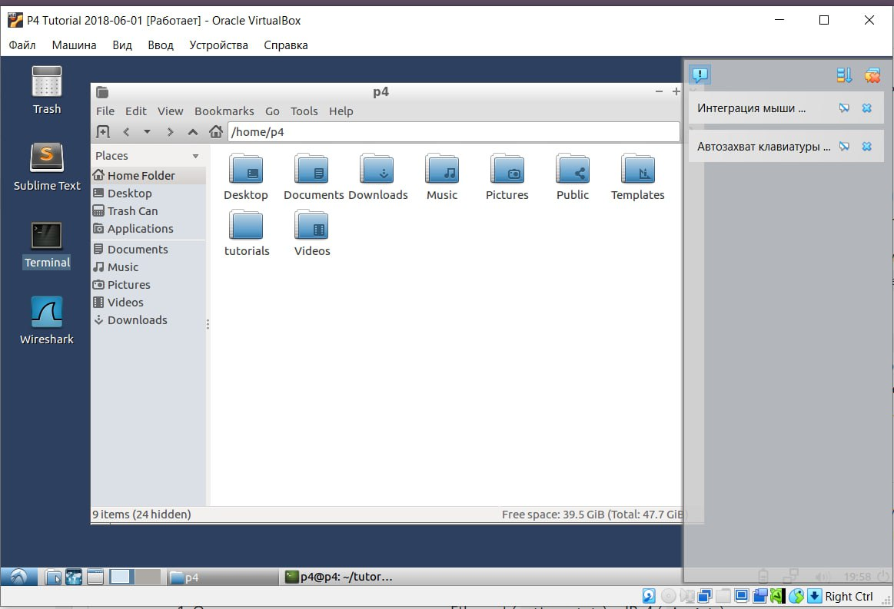
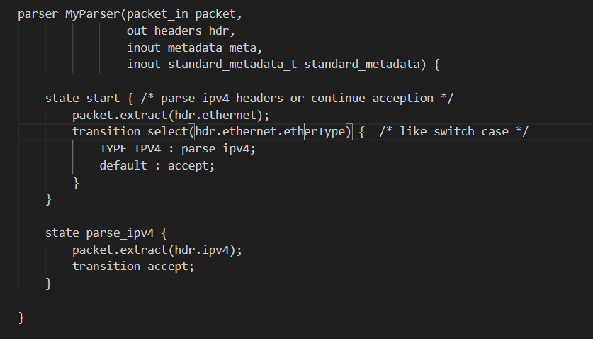
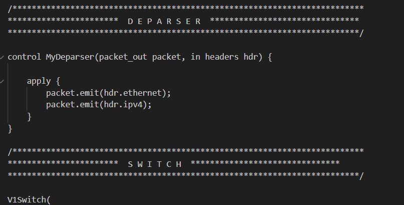
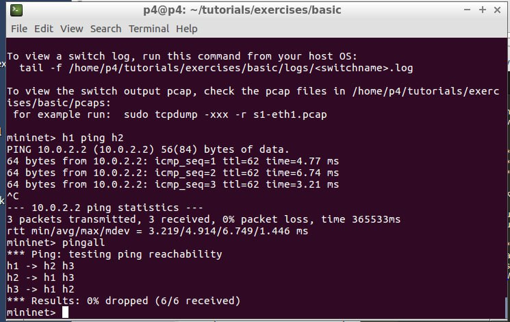
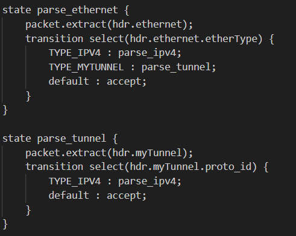
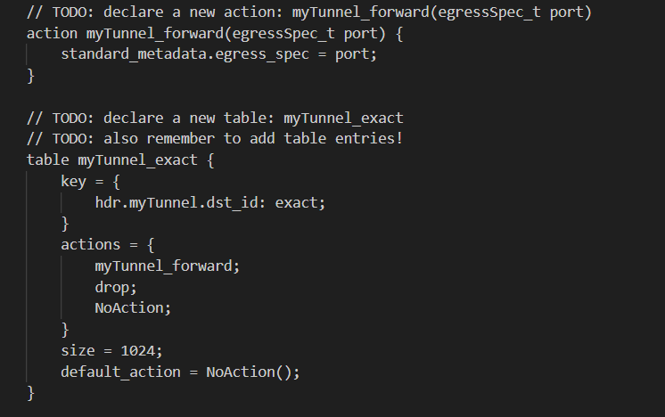
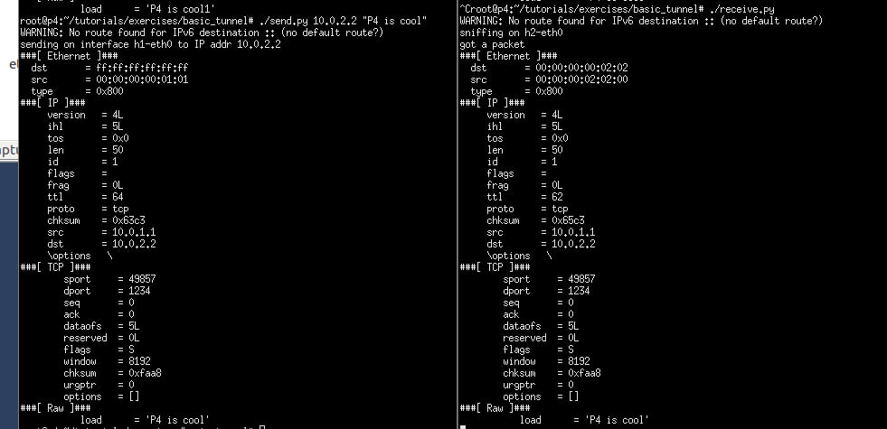
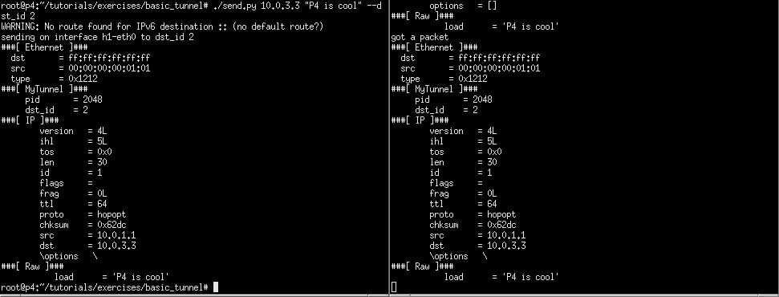
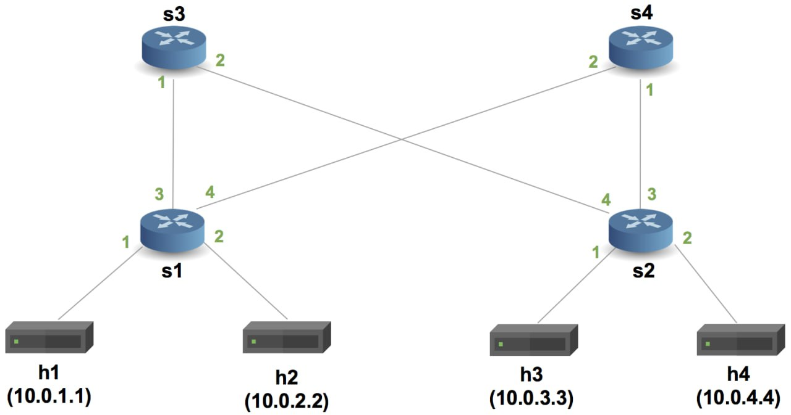

University: [ITMO University](https://itmo.ru/ru/)

Faculty: [FICT](https://fict.itmo.ru)

Course: [Network programming](https://github.com/itmo-ict-faculty/network-programming)

Year: 2024/2025

Group: K3320

Author: Bakhtina Anastasia Viacheslavovna

Lab: Lab4

Date of create: 31.05.2025

Date of finished: 31.05.2025

# Отчёт по лабораторной работе №4 "Базовая 'коммутация' и туннелирование используя язык программирования P4"

***Цель:*** Изучить синтаксис языка программирования P4 и выполнить 2 задания обучающих задания от Open network foundation для ознакомления на практике с P4.

## Ход работы

### Задание 1

1. Был взят образ с сайта и через импорт конфигураций запущена машина в связи с тем, что путь через vagrant был без графического интерфейса.



2. Была запущена команда в первом задании.

```bash
make run
```

3. Была неуспешная попытка ping
   

4. Был изучен основной синтаксис p4. Основные моменты, которые потребуются, это:

- transition - перевод в другое состояние
- emit - возвращает в выходной пакет указанный header
  
- select - аналог switch case, только для состояний

5. Дополним код парсера, а именно парсинг ipv4 хеадера или в противном случае переход с состояние accept, которое нужно для принятия следующих пакетов



6. Дополним код ингресс для проверки и пересылки пакетов, изменяющий заголовки:


7. Дополним код депарсера, а именно создадим выходной пакет на основе входного



8. Запустим и получим успешные пинги



### Задание 2

1. Сразу приступим к коду.

2. Дополним код парсера: добавим состояние для туннеля и включим его в select.



3. Дополним код депарсера для туннеля, добавим в выходной заголовок:


4. Дополним код ingress: объявим новую таблицу mytunnel_exact и действие mytunnel_forward, записывающее порт.



5. Проверим корректность работы





## Схема работы

### Задание 1



### Задание 2


